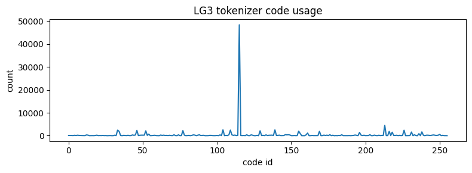
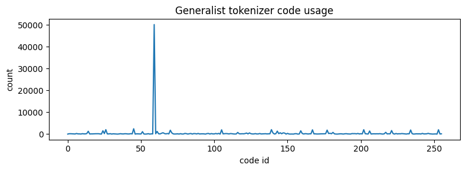
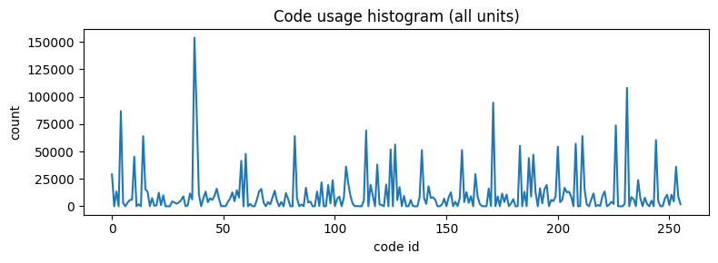

# 🚀 LG3 예측 파이프라인 (LG3 Prediction Pipeline)

이 저장소는 LG3 데이터의 전처리부터 토큰화, 최종 예측 모델(Forecaster) 학습까지의 전체 파이프라인을 포함하고 있습니다.

---

## 🏗️ 코드 구현 및 파이프라인 가이드

프로젝트의 핵심 로직은 데이터 정제 → 토크나이징 → 학습의 5단계 스텝으로 구성됩니다.

### 1. 데이터 위치
현재 README.md가 있는 위치에 data폴더를 만들고 하위에 EREPORT와 SMARTCARE를 넣으면 됩니다. (아직 여러종류의 데이터세트는 고려되지 않음.)

### 1. 스크립트 실행 순서

중간 산출물(Artifacts)이 이미 존재한다면 해당 단계는 건너뛰어도 무방합니다.

| 단계 | 실행 스크립트 | 주요 기능 및 역할 |
| --- | --- | --- |
| **Step 1** | `prepare_lg3_data.sh` | EREPORT + SMARTCARE 기반 유닛별 데이터셋 생성 (15분 리샘플링 및 시간 필터 적용) |
| **Step 2** | `save_revin_data.sh` | RevIN 적용 및 개별 유닛 데이터를 학습용 샘플 단위로 병합 |
| **Step 3** | `train_vqvae.sh` | 시계열 특징 추출을 위한 **VQ-VAE 토크나이저** 학습 |
| **Step 4** | `extract_forecasting_data.sh` | 학습된 토크나이저를 이용해 시계열을 토큰 시퀀스로 변환 |
| **Step 5** | `train_forecaster.sh` | 토큰화된 데이터를 사용해 최종 **Forecaster** 모델 학습 |

### 2. 주요 구현 디테일

* **데이터 조인:** EREPORT를 베이스로 하며, SMARTCARE 데이터는 유닛별로 조인합니다. (`Auto Id`는 그룹핑 목적으로만 활용)
* **데이터 노이즈 제거:** 반복적인 패턴으로 인한 토큰 편향을 막기 위해 **00:00–06:00 시간대 데이터를 제외**했습니다.
* **디버깅 정책:** CSV 파싱 이슈 발생 시 `pdb`가 자동 실행됩니다. 터미널에 `pdb` 진입 시 `c`를 입력하여 프로세스를 계속 진행하십시오.
* **Comet ML:** 현재 로깅은 비활성화 상태입니다. 협업 시 API Key를 설정 파일에 추가하여 활성화할 수 있습니다.

---

## 🧪 데모 및 시각화 (`lg3/example/`)

코드의 동작 방식을 직관적으로 이해할 수 있는 노트북 파일들입니다.

* `lg3_prepare_lg3_data_demo.ipynb`: 리샘플링 및 데이터 동기화/병합 과정 확인
* `lg3_tokenizer_eval_demo.ipynb`: 토크나이저의 재구성(Reconstruction) 품질 및 토큰 효율성 비교
* `lg3_token_id_dominance_demo.ipynb`: 특정 토큰의 집중 현상(Dominance) 시각화

---

## 🔄 변경점 및 향후 계획 (Updates & TODO)

### ✅ 최근 변경 사항: 시간 필터링 적용

1월 13일 회의 결과에 따라, 전체 데이터를 토큰화할 경우 특정 토큰에 과도하게 편향되는 문제를 확인했습니다. 이를 해결하기 위해 **심야 시간대(00-06시)를 제외**하여 토큰의 다양성을 확보했습니다.

*> 위 지표를 통해 필터링 후 토큰 사용 빈도가 더 균등해진 것을 확인할 수 있습니다.*

### 📝 To-Do List

* [x] 편향된 시계열 패턴 제외 및 토큰 빈도 재검증
* [ ] **Forecaster** 모델 최적화 및 학습
* [ ] **Translator** 모델 설계 및 학습
* [ ] 과거 수 주간 데이터 포함 시 예측 성능 향상 여부 검증 (Ablation Study)

---

**Tip:** 전체 데이터를 사용하여 재학습이 필요한 경우 `lg3/scripts/prepare_lg3_data.sh` 내의 필터 옵션을 수정하십시오.

내 생각에는 extract forecasting data가 제대로 개발단계를 못 따라온 것 같아. 확인해보면 csv가 있지만 auto
  id별로 나뉘어서 하위 폴더에 있어. 이렇게 된 이유는 데이터세트를 만들 때 단순하게 auto id를 같은 시간에
  있다고 11개 concatnate시키면 시계열데이터가 시간순서를 지키지 못하는 문제가 있기 때문이지. 그래서
  데이터세트를 만들 때는 이러한 autoid별 csv를 이용해서 concatenate시키는 방식을 이용하는 방법밖에 없어.

   트랜스포머 모델 크기: d_model=64, nlayers=4 (비교적 작은 모델)
   >>    1 # 아래 4줄을 train_forecaster.sh의 마지막에 추가
   2   --d-model 128 \
   3   --d_hid 512 \
   4   --nlayers 8 \
   5   --nhead 8